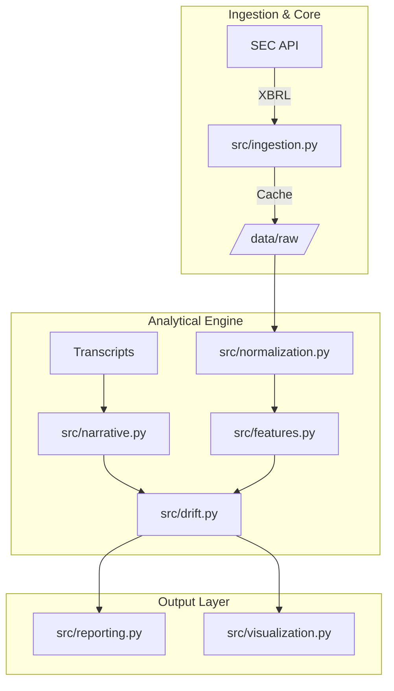

# Financial Narrative Drift Detection System

## 1. Overview

This system quantifies divergence between management narrative and financial performance using structured accounting signals and deterministic NLP extraction from earnings transcripts. It establishes a quantitative "Drift Score" to identify periods where corporate messaging decouples from fundamental fiscal reality.

### System Outputs
* Normalized quarterly financial dataset
* Engineered financial quality metrics (Accrual intensity, OCF conversion)
* Structured narrative metrics (Optimism, Risk)
* Drift score per quarter
* Deterministic explanation generation
* High-fidelity momentum visualizations

---

## 2. System Architecture



### Module Definitions
* **`ingestion.py`**: SEC XBRL retrieval, unit-scaling extraction, and local caching.
* **`normalization.py`**: Canonical schema enforcement and mandatory pillar validation.
* **`features.py`**: Financial quality and accounting momentum computation.
* **`narrative.py`**: Pydantic-enforced structural extraction from earnings transcripts.
* **`drift.py`**: Dual-track momentum and divergence (drift) computation.
* **`reporting.py`**: Deterministic natural language explanation generation.
* **`pipeline.py`**: End-to-end analytical orchestration.

---

## 3. Methodology

### Financial Features
The system computes the following pillars of earnings quality:

* **Free Cash Flow**: $FCF = OCF - Capex$
* **Accrual Ratio**: $AR = (Net\ Income - OCF) / Total\ Assets$
* **OCF Conversion**: $Ratio = OCF / Net\ Income$

These metrics identify accrual intensity and cash flow divergence, providing a robust baseline for management performance.

### Narrative Features
Sentiment and risk signals are extracted using a deterministic LLM configuration:
* **Optimism Score**: Bounded [-1, 1], representing the net sentiment of forward-looking statements.
* **Risk Mentions**: Integer count of explicit risk factors or contingencies disclosed.
* **LLM Parameters**: Temperature = 0, Seed = 42, Pydantic-enforced JSON schema.

### Drift Score Derivation
The primary signal is the delta between Narrative and Financial Momentum:

$M_{fin} = \omega_1 \cdot RevenueGrowth + \omega_2 \cdot OCFGrowth + \omega_3 \cdot \Delta Accruals$  
$M_{nar} = \omega_4 \cdot \Delta Optimism - \omega_5 \cdot \Delta Risk$

**Drift Score** $= M_{nar} - M_{fin}$

* **Positive Score**: Narrative exceeds fundamental performance (potential over-optimization/hype).
* **Negative Score**: Narrative is more conservative than fundamental performance (potential sandbagging).

---

## 4. Installation

### Requirements
* **Python**: 3.11+
* **SEC User Agent**: Required for regulatory compliant API access.
* **OpenAI API Key**: Required for structured signal extraction.

### Setup
```bash
# Clone repository
git clone https://github.com/timothykimutai/Financial-Drift-Detection-Engine.git
cd Financial-Drift-Detection-Engine

# Environment Configuration
cp .env.example .env
# Edit .env with SEC_USER_AGENT and OPENAI_API_KEY

# Dependency Install
pip install -r requirements.txt
```

### Docker Execution
```bash
docker compose up --build
docker run --env-file .env -v $(pwd)/outputs:/app/outputs drift-engine --tickers NVDA
```

---

## 5. Usage

Invoke the orchestrator for specific securities and time horizons:

```bash
python main.py --tickers AAPL MSFT --start_year 2018 --end_year 2024
```

### Output Hierarchy
Results are versioned at `outputs/{ticker}/{YYYYMMDD}/`:
* `drift_analysis.csv`: Combined financial and narrative signals.
* `drift_series.png`: Time-series momentum comparison.
* `momentum_comparison.png`: Radar chart of divergence.
* `/logs/pipeline.log`: Full structured operational audit trail.

---

## 6. Testing

The system employs a strict 11-test suite covering ingestion integrity, normalization edge cases, and pipeline parity.

```bash
# Run all tests
python -m unittest discover tests
```

**Deterministic Check**: Repeated runs against identical SEC JSON data produce bit-identical drift scores.

---

## 7. Data Sources
* **SEC EDGAR**: Primary source for GAAP financial facts (XBRL).
* **OpenAI**: Inference provider for structured narrative signal hydration.
* **Local Ingestion**: Cached JSON blocks for research reproducibility.

---

## 8. Limitations
* **GAAP Dependent**: Optimized for US GAAP filings; IFRS support restricted.
* **Heuristic Weights**: Momentum weights are expert-defined, not statistically optimized via backtest.
* **Sector Neutrality**: No sector-relative normalization (e.g., Tech vs. Industrials have different accrual baselines).
* **Anomaly Sensitivity**: Extreme quarterly anomalies (e.g. large one-time impairments) can skew short-term drift scores.

---

## 9. Future Work
* **Sector-Relative Normalization**: Industry-specific baselines for accrual quality.
* **Backtest Validation**: Statistical correlation between drift scores and subsequent equity volatility.
* **API Layer**: Stateless FastAPI endpoint for real-time portfolio screening.

---

## 10. License
Internal Use / Proprietary (Modify as needed for open source).
