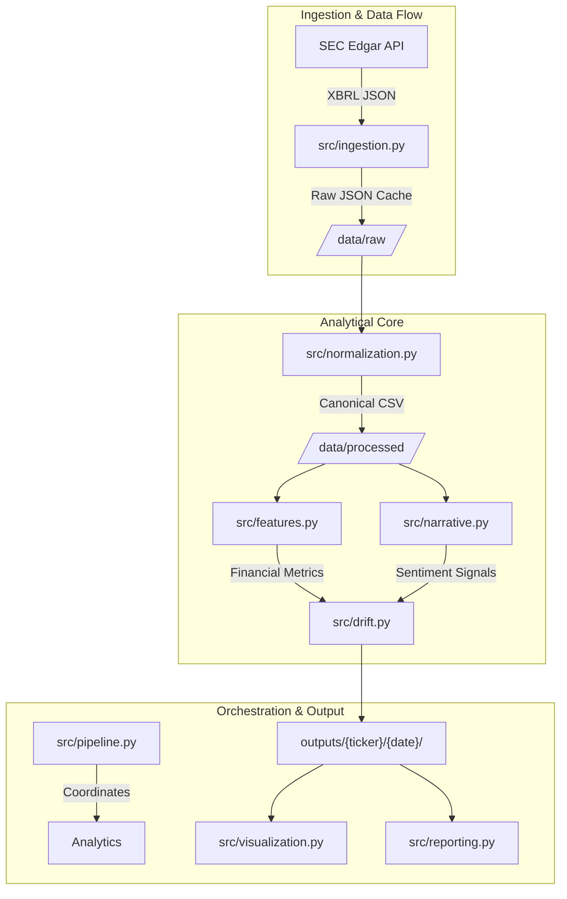

# Financial Narrative Drift Detection System


A professional, research-grade quantitative analytical instrument designed to detect structural divergence between corporate narrative and objective financial performance.

## 🏛️ System Architecture



## 🚀 Deployment & Operations

### 1. Persistent Environment (Docker)
The recommended way to run the engine is via Docker to ensure environment determinism.

```bash
# Clone and build
docker build -t drift-engine .

# Run analysis for specific tickers
docker run --env-file .env -v $(pwd)/outputs:/app/outputs drift-engine --tickers NVDA MSFT
```

### 2. Manual CLI Setup
```bash
pip install .
python main.py --tickers AAPL --start_year 2022
```

### 3. Environment Configuration
Create a `.env` file based on `.env.example`:
- `SEC_USER_AGENT`: Required for SEC API access ("Name (email)")
- `OPENAI_API_KEY`: Required for narrative sentiment extraction
- `LOG_LEVEL`: defaults to `INFO`

## 📊 Analytical Methodology

### Drift Score Calculation
Structural divergence is measured by the delta between Narrative Momentum ($M_{nar}$) and Financial Momentum ($M_{fin}$):

$$D = M_{nar} - M_{fin}$$

Where:
- $M_{fin}$ is a weighted vector of Revenue Growth, OCF Growth, and Accrual Quality.
- $M_{nar}$ is a weighted vector of Optimism and Risk trajectory.

## 📁 Storage Discipline & Observability
- **`/data/`**: Tiered storage for raw and processed analytical artifacts.
- **`/outputs/`**: Versioned historical results (`{ticker}/{YYYYMMDD}/`).
- **`/logs/`**: Structured observability via `pipeline.log`.

## 🧪 Testing & Validation
Unit and integration tests are strictly enforced via the CI pipeline.
```bash
python -m unittest discover tests
```
